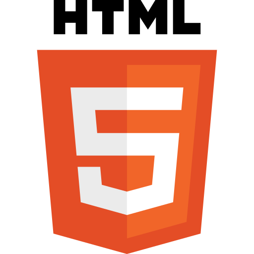
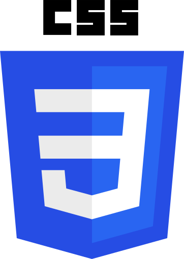
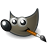
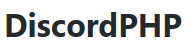

<h1 align="center"> Hi there, I'm ProgramistaZpolski 👋 </h1>

  - I'm currently working on **webdev challenges**
  - I'm currently learning **PHP**
  - Ask me about **HTML/CSS/JS**
  - How to reach me: **<a href="mailto:piotrbadelek@protonmail.com">piotrbadelek@protonmail.com</a>**
  - Fun fact: **My first program was a web browser in Visual Basic** (Winforms)
  
### Programming Languages / Tools

            

 

]

 

<!--
**ProgramistaZpolski/programistazpolski** is a ✨ _special_ ✨ repository because its `README.md` (this file) appears on your GitHub profile.

Here are some ideas to get you started:

- 🔭 I’m currently working on ...
- 🌱 I’m currently learning ...
- 👯 I’m looking to collaborate on ...
- 🤔 I’m looking for help with ...
- 💬 Ask me about ...
- 📫 How to reach me: ...
- 😄 Pronouns: ...
- ⚡ Fun fact: ...
-->
